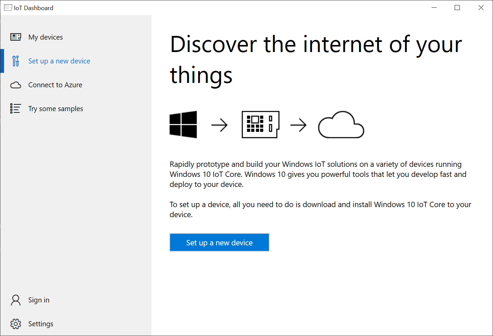
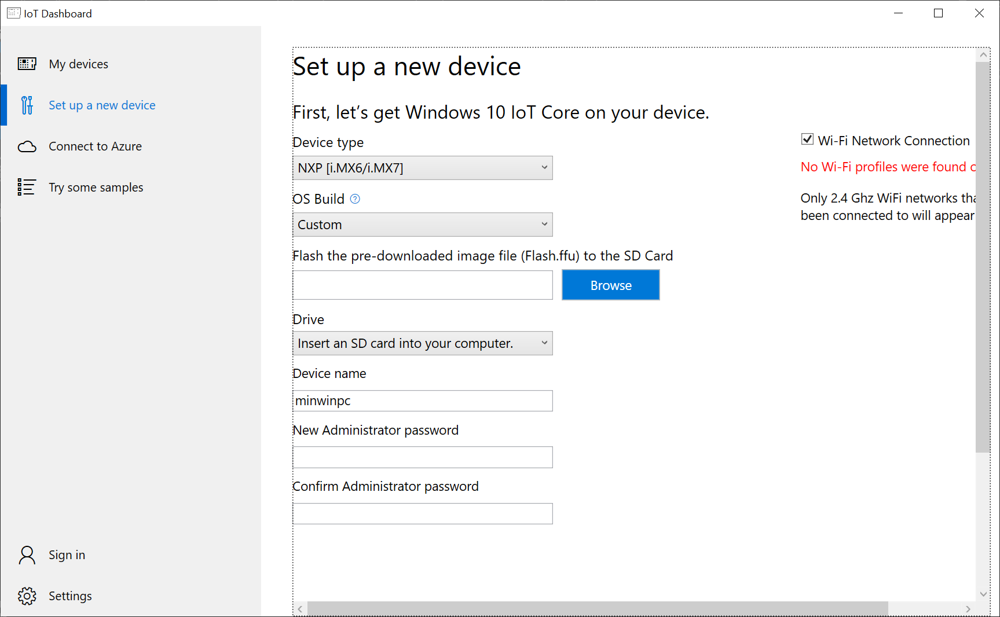
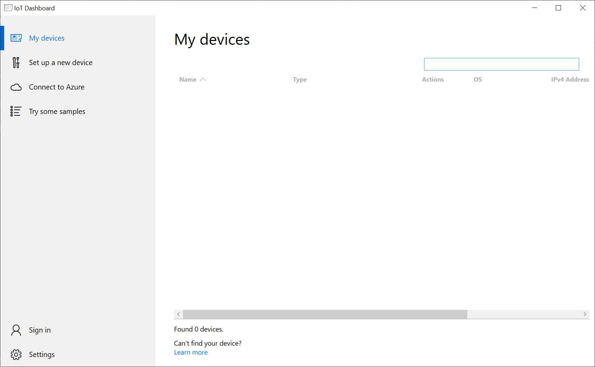

# Lab 2 - Deploying an image to the device

In lab 1 we created our first image and now it's time to deploy it to the board and see that it boots.

## Flashing the SD Card

The easiest way to do this is to use the Windows IoT Core Dashboard (yop can do this with Dism as well if you wish). The Windows IoT Core Dashboard will reformat the SD Card, create the correct partition layout for the board and then it actually uses Dism to push the image to the SD Card.

1. Open `Windows IoT Core Dashboard:

2. Select `Setup a new device` and then select `NXP` and then the FFU from LAB 1(`todo: Replace with on disk location`). Set the name and administrator password as you wish and click install.

3. Eject SD card adapter and place the actual SD card into the NXP Board.

4. Connect the power and wait for the board to appear in the Windows IoT Core Dashboard:

5. Right click on the device and select the `Device Portal`. You'll be prompted to enter a user name and password. The user is `administrator` and the password is what you set earlier.

6. Explorer the device in the portal and when ready move to lab 3.